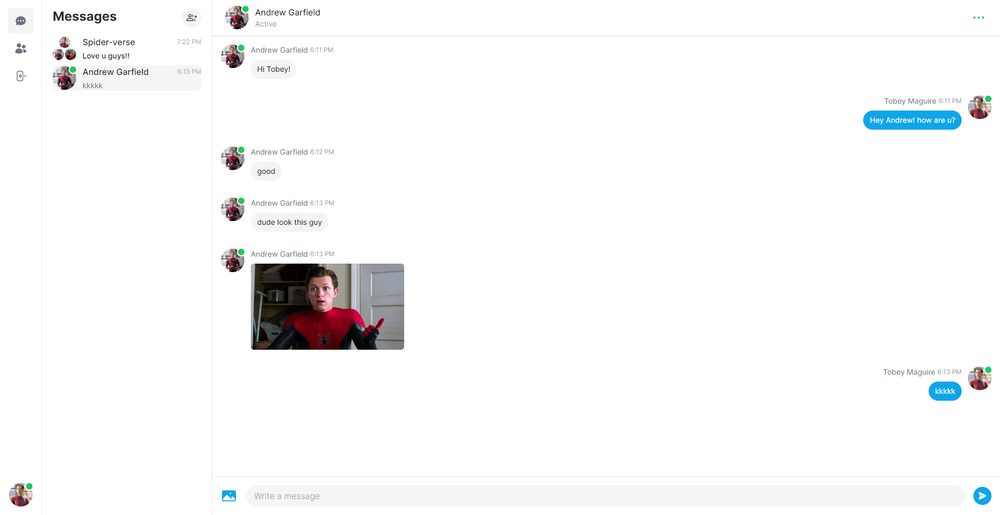
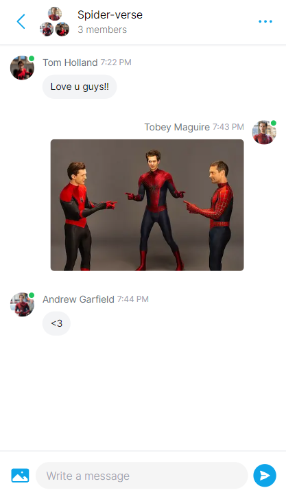

# DevMessage

- [Link do Projeto](https://dev-message.vercel.app)

Mensageiro em tempo real inspirado no Messenger do Facebook, desenvolvido com Next.js, Tailwind CSS, Prisma, MongoDB, NextAuth e Pusher.

  
   
  <strong>Desktop</strong>

 

  
   
  <strong>Mobile</strong>

## Visão Geral

O DevMessage é uma aplicação de mensagens em tempo real que permite a comunicação de forma eficiente. Ele oferece uma experiência semelhante ao Messenger do Facebook.

## Tecnologias Utilizadas

- **Next.js 14:** Framework React para renderização do lado do servidor.
- **Tailwind CSS:** Um utilitário de primeiro plano para estilização de componentes.
- **Prisma:** ORM (Object-Relational Mapping) para interagir com o banco de dados.
- **MongoDB:** Banco de dados NoSQL para armazenamento de dados.
- **NextAuth:** Biblioteca de autenticação para autenticação de usuários.
- **Pusher:** Serviço de troca de mensagens em tempo real.

## Funcionalidades Principais

- **Autenticação Segura:** Use o NextAuth para autenticação segura dos usuários.
- **Mensagens em Tempo Real:** Troque mensagens de forma instantânea.
- **Autenticação Segura:** Use o NextAuth para autenticação segura dos usuários.
- **Grupos de conversas:** Comunique-se instantaneamente com mais de uma pessoa.
- **Persistência de Dados:** Utilize o Prisma e o MongoDB para armazenar dados de forma eficiente.
- **Interface Responsiva:** O Tailwind CSS proporciona uma experiência de usuário agradável e responsiva.